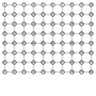
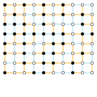

# TropicalTensors

Solving spinglass ground state with [Yao](https://github.com/QuantumBFS/Yao.jl). It contains

* Spinglass solvers for three predefined lattices,including
    * square lattice,
    * cylinder lattice,
    * chimera lattice,
    * second-nearest neighor coupled square lattice.
* [GPU backend](https://github.com/JuliaGPU/CUDA.jl),
* [Forward mode](https://github.com/JuliaDiff/ForwardDiff.jl) automatic differentiation and [reversible programming automatic differention](https://github.com/GiggleLiu/NiLang.jl) to find the optimal configuration,
* A [visualization toolkit](https://github.com/GiggleLiu/Viznet.jl).

## To Start

Type `]` in Julia REPL to enter pkg mode and
```julia pkg
pkg> add https://github.com/TensorBFS/TropicalTensors.jl.git#master
pkg> add CuYao
```
The last line is required only when you use GPU for computing.

## Gists
For someone who are interested in the implementation, we provide a minimum implementation (~50 lines) of tropical circuit based spinglass solver about
#### 1. Finding maximum energy
https://gist.github.com/GiggleLiu/db9efa143aefbbe1d542e7b78d3a65bc

#### 2. Counting degeneracy
https://gist.github.com/wangleiphy/ef1f616f26ab37ef7fd3d329f2a5be0e

## Examples
First we define the lattice and coupling.

```julia repl
julia> using TropicalTensors

julia> lt = SquareLattice(10, 8);

julia> Js = rand([-1,1], length(sgbonds(lt)));

julia> hs = zeros(Int, length(sgvertices(lt)));

julia> sg = Spinglass(lt, Js, hs);
```

Similarly, we can the problem on lattices like
* `ChimeraLattice(4, 4)`
* `Cylinder(10, 8)`
* `rand_maskedsquare(8, 10, 0.8)`.

One can visualize the lattice by dumping it to an `svg` file

```julia repl
julia> using Compose, Viznet

julia> Compose.set_default_graphic_size(12cm, 12cm)

julia> showlattice(lt) |> SVG("_output.svg")
false
```

You will see the following graph



#### Case 1: Computing the maximum energy

```julia repl
julia> solve(sg; usecuda=false)
Layer 1/10
Layer 2/10
Layer 3/10
Layer 4/10
Layer 5/10
Layer 6/10
Layer 7/10
Layer 8/10
Layer 9/10
Layer 10/10
Tropical(106)
```

#### Case 2: Computing the energy degeneracy
```julia repl
julia> solve(CountingTropical{Int}, sg; usecuda=false)
Layer 1/10
Layer 2/10
Layer 3/10
Layer 4/10
Layer 5/10
Layer 6/10
Layer 7/10
Layer 8/10
Layer 9/10
Layer 10/10
CountingTropical{Int64}(106, 1504)
```

#### Case 3: Computing the optimal spin configuration with [ForwardDiff](https://github.com/JuliaDiff/ForwardDiff.jl) and [CUDA](https://github.com/JuliaGPU/CUDA.jl)
```julia repl
julia> using ForwardDiff, CUDA

julia> ForwardDiff.gradient(hs) do x
           sg = Spinglass(lt, eltype(x).(Js), x)
           solve(sg; usecuda=true).n
       end
Layer 1/10, stack size: 0 & 0
Layer 2/10, stack size: 0 & 0
Layer 3/10, stack size: 0 & 1
...
  1
 -1
 -1
  1
 -1
  1
 -1
  1
 -1
```

#### Case 4: Computing the optimal spin configuration with [NiLang](https://github.com/GiggleLiu/NiLang.jl)

```julia repl
julia> using TropicalTensors.Reversible: opt_config

julia> cfg = opt_config(sg);
Layer 1/10, stack size: 0 & 0
Layer 2/10, stack size: 0 & 0
Layer 3/10, stack size: 0 & 1
Layer 4/10, stack size: 0 & 2
Layer 5/10, stack size: 0 & 3
Layer 6/10, stack size: 0 & 4
Layer 7/10, stack size: 0 & 5
Layer 8/10, stack size: 0 & 6
Layer 9/10, stack size: 0 & 7
Layer 10/10, stack size: 0 & 8
Layer 10/10, stack size: 0 & 8
Layer 9/10, stack size: 0 & 7
Layer 8/10, stack size: 0 & 6
Layer 7/10, stack size: 0 & 5
Layer 6/10, stack size: 0 & 4
Layer 5/10, stack size: 0 & 3
Layer 4/10, stack size: 0 & 2
Layer 3/10, stack size: 0 & 1
Layer 2/10, stack size: 0 & 0
Layer 1/10, stack size: 0 & 0

julia> vizoptconfig(cfg) |> SVG("_optconfig.svg")
```

You will see the following graph


